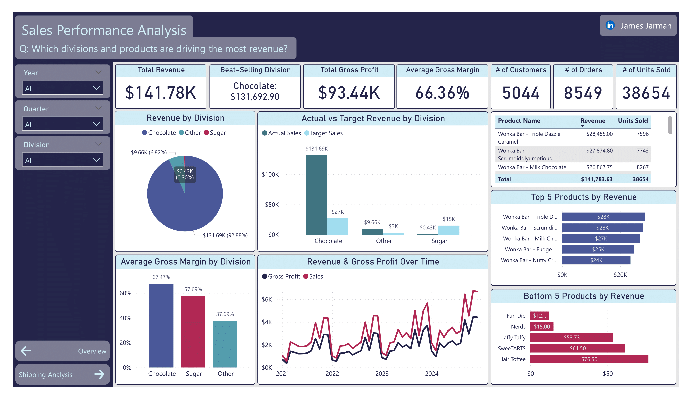
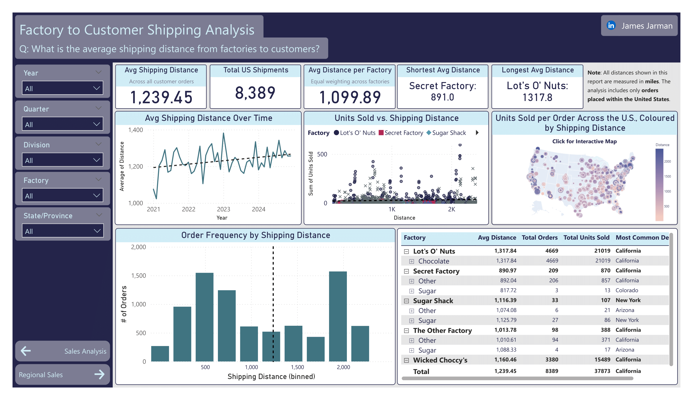
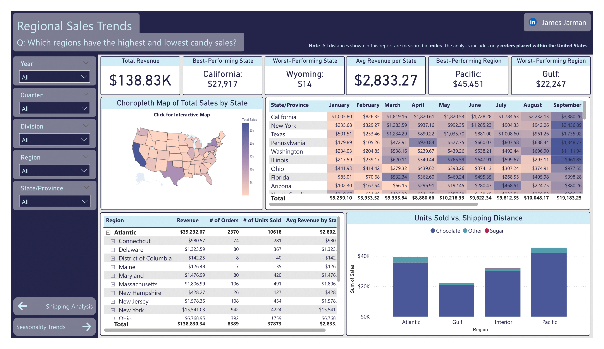

# US Candy Distributor Sales & Shipping Analysis

This Power BI report explores sales, shipping, and regional performance for a US-based candy distributor using raw order data from 2021–2024.  
The project was built using **SQL**, **Power BI**, and **Python**, and is designed to uncover product-level profitability, optimise shipping logistics, and guide strategic decisions across regions and factories.

View the full [Project Brief (PDF)](./project_brief_US_Candy_Distributor.pdf) for business context, goals, and stakeholder questions.

---

## Table of Contents

- [Project Objectives](#-project-objectives)
- [Tools & Technologies](#-tools--technologies)
- [Process & Methods](#️-process--methods)
- [Dashboard Overview](#-dashboard-overview)
- [Key Insights](#-key-insights)
- [Next Steps & Future Improvements](#-next-steps--future-improvements)
- [Project Structure](#-project-structure)
- [How to Use This Project](#-how-to-use-this-project)

---

## Project Objectives

- Identify **top-performing products and divisions** by revenue and profitability.
- Analyse **average shipping distances** from factories to customers.
- Determine **regional sales trends** to guide geographic strategy.
- Visualise data to support strategic decisions using **Power BI dashboards**.

---

## Tools & Technologies

| Tool               | Purpose                              |
|--------------------|---------------------------------------|
| SQL Server (T-SQL) | Data cleaning and transformation      |
| Power BI           | Data modelling and dashboard creation  |
| Python (in Power BI) | Map visualisations (geospatial)    |
| CSV Files          | Raw data input                        |
| DAX                | Custom measures and KPIs              |

---

## Process & Methods

### Data Ingestion
- Loaded all `.csv` datasets into SQL Server.
- Cleaned and transformed data via SQL scripts.
  - Fixed data inconsistencies (e.g., product name typos).
  - Removed duplicates by grouping on `order_id` and aggregating metrics.
  - Dropped `row_id` and unnecessary columns.

### Data Cleaning & Filtering
- Final cleaned dataset reduced to **8,549 orders**.
- For **shipping distance analysis**, only **U.S. orders** were retained (8,389 rows) due to missing Canadian location data.

### Data Modelling
- Created star schema in Power BI with relationships between fact and dimension tables.
- Built custom DAX measures (e.g., total revenue, average distance).
- Used **Import Mode** for optimal performance.

#### Star Schema Diagram

### Visualisations
- Created report pages per key question.
- Python visuals used for customer-factory distance mapping (due to Power BI subscription limits).
- Custom slicers added for user interactivity (e.g., Region, Division, Year).

---

## Dashboard Overview

| Report Page                     | Focus Area                                |
|--------------------------------|--------------------------------------------|
| Sales Performance Analysis     | Division/product revenue and profitability |
| Shipping Analysis              | Average shipping distances and logistics   |
| Regional Sales Trends          | Best/worst-performing U.S. regions         |
| Seasonality & Trends *(WIP)*  | Month-on-month sales and trends            |

### Report Previews

#### Sales Performance Page

#### Shipping Analysis Page

#### Regional Trends Page

---

## Key Insights

### Sales Drivers
- **Chocolate division** leads in both revenue and gross profit.
- **Wonka Bar Chocolate** is the top-selling product by a wide margin.
- Year-over-year revenue shows consistent growth (2021–2024).

### Shipping Logistics
- **Average shipping distance** is approximately **1,240 miles**.
- **Secret Factory** serves customers closest on average.
- **Lot’s O’ Nuts Factory** covers the longest distances and ships the most units.

### Regional Trends
- **California** is the top-performing state.
- **Wyoming** has the lowest revenue.
- **Pacific region** significantly outperforms others; **Gulf region** underperforms.

---

## Next Steps & Future Improvements

If more time or data were available:

- Include **Canadian orders** once zip/location data becomes available.
- Add **forecasting models** based on historical seasonality and sales.
- Expand **shipping cost efficiency** analysis (distance vs. cost).
- Add deeper **customer segmentation** and cohort tracking.
- Improve interactivity with **drill-throughs** and **tooltip insights** in Power BI.

---

## Project Structure

project-root/
├── data/
│   ├── *.csv                 # Raw data files
│   ├── *.sql                 # SQL cleaning and transformation scripts
│   ├── *.ipynb               # Python mapping code
│   └── *.png                 # Power BI screenshots
├── notes-US-Candy/
│   ├── *.md                  # Project notes (Obsidian vault)
│   └── .obsidian/            # Obsidian configuration files
├── pbi_reports/
│   ├── report_US_Candy_Distributor.pbix
│   └── theme.json            # Custom Power BI theme
└── README.md                 # You are here!