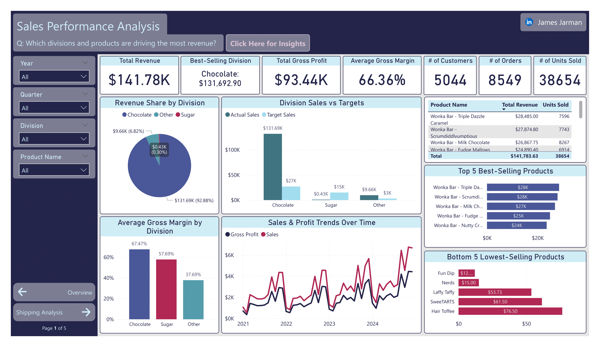

# US Candy Distributor Sales & Shipping Analysis

This Power BI report explores sales, shipping, and regional performance for a US-based candy distributor using raw order data from 2021–2024.  
This project was developed using **SQL**, **Power BI**, and **Python**, and is designed to uncover product-level profitability, optimise shipping logistics, and guide strategic decisions across regions and factories.

View the full [Project Brief (PDF)](./project_brief.pdf) for business context, goals, and stakeholder questions.

---

## Table of Contents

- [Project Objectives](#-project-objectives)
- [Tools & Technologies](#-tools--technologies)
- [Process & Methods](#️-process--methods)
- [Dashboard Overview](#-dashboard-overview)
- [Key Insights](#-key-insights)
- [Next Steps & Future Improvements](#-next-steps--future-improvements)
- [Project Structure](#-project-structure)
- [How to Use This Project](#-how-to-use-this-project)

---

## Project Objectives

- Identify **top-performing products and divisions** by revenue and profitability.
- Analyse **average shipping distances** from factories to customers.
- Determine **regional sales trends** to guide geographic strategy.
- Visualise data to support strategic decisions using **Power BI dashboards**.

---

## Tools & Technologies

| Tool               | Purpose                              |
|--------------------|---------------------------------------|
| SQL Server (T-SQL) | Data cleaning and transformation      |
| Power BI           | Data modelling and dashboard creation  |
| Python (via Power BI Python visuals) | Map visualisations (geospatial)    |
| CSV Files          | Raw data input                        |
| DAX                | Custom measures and KPIs              |

---

## Process & Methods

### Data Ingestion
- Loaded all `.csv` datasets into SQL Server.
- Cleaned and transformed data via SQL scripts.
  - Fixed data inconsistencies (e.g., product name typos).
  - Removed duplicates by grouping on `order_id` and aggregating metrics.
  - Dropped `row_id` and unnecessary columns.

### Data Cleaning & Filtering
- Final cleaned dataset reduced to **8,549 orders**.
- For **shipping distance analysis**, only **US orders** were used (8,389 rows) due to missing Canadian location data.

### Data Modelling
- Created star schema in Power BI with relationships between fact and dimension tables.
- Built custom DAX measures (e.g., total revenue, average distance).
- Used **Import Mode** for optimal performance.

### Visualisations
- Created report pages per key question.
- Python visuals used for customer-factory distance mapping (due to Power BI subscription limits).
- Custom slicers added for user interactivity (e.g., Region, Division, Year).

---

## Dashboard Overview

| Report Page                    | Focus Area                                 |
|--------------------------------|--------------------------------------------|
| Sales Performance Analysis     | Division/product revenue and profitability |
| Shipping Analysis              | Average shipping distances and logistics   |
| Regional Sales Trends          | Best/worst-performing U.S. regions         |
| Seasonality & Trends           | Month-on-month sales and trends            |

### Report Previews

#### Sales Performance Page


#### Shipping Analysis Page


#### Regional Sales Page


#### Seasonality & Sales Page


---

## Key Insights

A summary of findings from the Power BI dashboard. For detailed insights and business recommendations, see the full [insights.md](./docs/insights.md) file or refer to the **Insights & Recommendations** page within the Power BI report.

### Sales Drivers
- **Chocolate division** leads in both revenue and gross profit.
- **Wonka Bar Chocolate** is the top-selling product by a wide margin.
- Year-over-year revenue shows consistent growth (2021–2024).

### Shipping Logistics
- **Average shipping distance** is approximately **1,240 miles**.
- **Secret Factory** serves customers closest on average.
- **Lot’s O’ Nuts Factory** covers the longest distances and ships the most units.

### Regional Trends
- **California** is the top-performing state.
- **Wyoming** has the lowest revenue.
- **Pacific region** significantly outperforms others; **Gulf region** underperforms.

### Seasonality & Trends
- **Sales peak in November and December**, aligning with major U.S. holidays.
- **February is consistently the lowest-performing month**, likely due to post-holiday slowdowns.
- Revenue shows **steady annual growth** from 2021 through 2024.
- Forecasting suggests **continued upward demand**, with expected peaks in late Q4.

---

## Viewing the Power BI Report

Due to workspace and subscription limitations in Power BI Service (Publish to Web not available for free accounts), this dashboard is not hosted online.

However, you can view the full interactive dashboard by downloading and opening the `.pbix` file in **Power BI Desktop**:

👉 [`US_Candy.pbix`](./reports/US_Candy.pbix)

> To explore the report:
> - Open the file in Power BI Desktop (free from Microsoft)
> - Use slicers to filter by year, region, division, etc.
> - Hover over charts for tooltips and insights
> - Navigate between pages using the built-in buttons
---

## Next Steps & Future Improvements

If additional time or data were available, further analysis could include:

- Incorporating **Canadian orders** once complete geolocation data is available.
- Expanding on **forecasting models** with more robust time series approaches.
- Analysing **shipping cost efficiency** by comparing distance to actual cost data.
- Developing **customer segmentation** and retention metrics based on behaviour or geography.
- Enhancing interactivity in Power BI with **drill-throughs** and **dynamic tooltips**.

---

## Project Structure

```
project-root/
├── data/
│ ├── raw/ # Original CSV files
│ ├── processed/ # Cleaned and finalised datasets
│ ├── notebooks/ # Python notebooks for geospatial preprocessing
│ └── sql_queries/ # SQL scripts for transformation and analysis
├── reports/
│ ├── US_Candy.pbix # Power BI report
│ ├── theme.json # Custom Power BI theme
│ ├── figures/ # Chart images used in README
│ └── screenshots/ # Full-page Power BI screenshots
├── docs/
│ ├── insights.md # Written insights and summary
│ ├── project_brief.pdf # Stakeholder business brief
│ └── report_summary.pdf # Optional static export of dashboard
├── notes/
│ └── write_up_notes.md # Personal project notes (Obsidian-friendly)
└── README.md
```