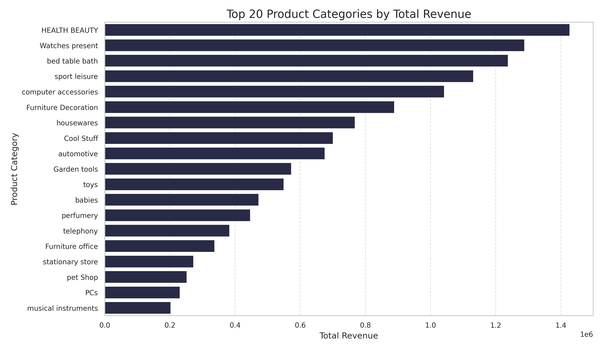
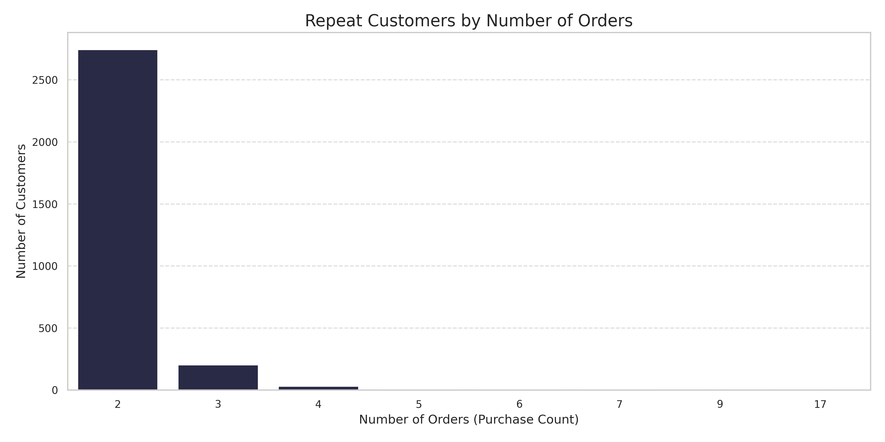
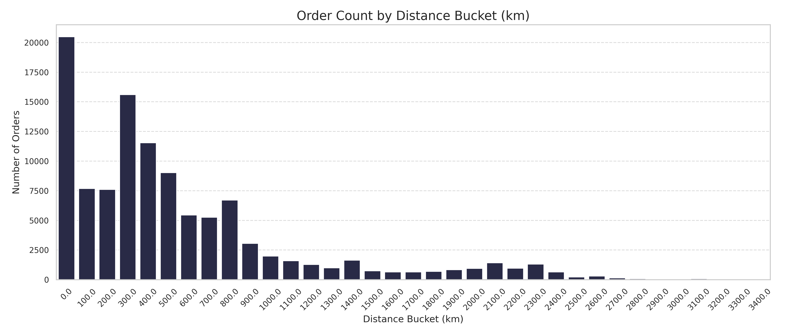
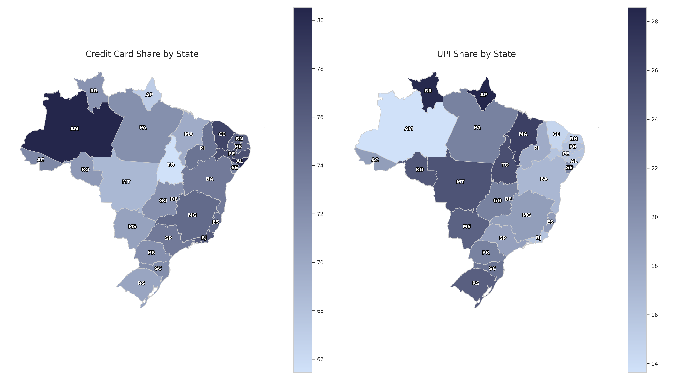
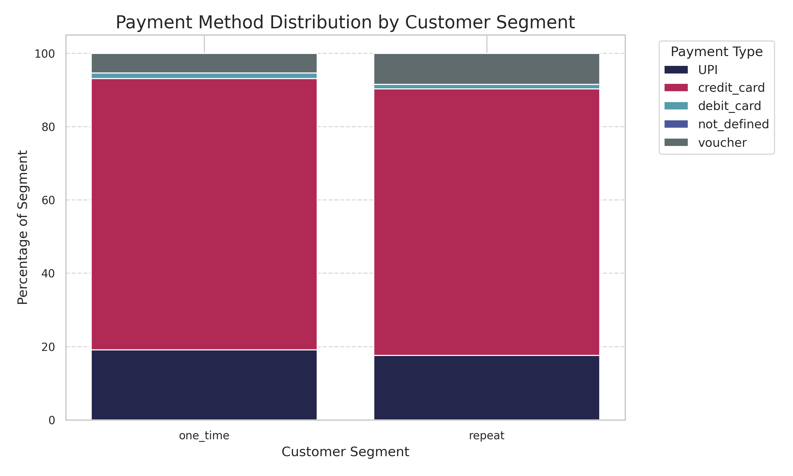

# Analysing Target E-Commerce in Brazil

This project investigates key performance and operational insights from a Brazilian e-commerce dataset using SQL queries. The goal is to address business-relevant questions by analysing orders, payments, products, customers, and more.

---

## Contents

0. [Data Sources](#data-sources)  
1. [Sales Analysis](#section-1-sales-analysis) & [Key Takeaways](#section-1-key-takeaways)
2. [Customer Behaviour](#section-2-customer-behaviour) & [Key Takeaways](#section-2-key-takeaways)
3. [Logistics and Shipping Performance](#section-3-logistics-and-shipping-performance) & [Key Takeaways](#section-3-key-takeaways)
4. [Product Insights](#section-4-product-insights) & [Key Takeaways](#section-4-key-takeaways)
5. [Payment Behaviour](#section-5-payment-behaviour) & [Key Takeaways](#section-5-key-takeaways)
6. [Geospatial and Regional Insights](#section-6-geospatial-and-regional-insights)  

---

## Data Sources

All analysis was performed on the `target_ecommerce` schema. The tables used include:

- `orders`
- `order_items`
- `payments`
- `products`
- `customers`
- `sellers`
- `geolocations`

For a full breakdown of the schema and relationships, refer to the [data dictionary](./data_dictionary.md) and the [Entity Relationship Diagram (ERD)](./erd/erd.png).

---

## **Section 1.** Sales Analysis

This section addresses key revenue and performance metrics by exploring the payments, orders, and order_items tables.

**Full SQL script for all Sales Analysis questions can be found [here](./sql/01_sales_analysis.sql).**

---

### Question 1: What is the total revenue generated per year and per month?

**Insight:**  
Revenue increased significantly from 2016 to 2018; however, it is important to note that the data only covers **3 months of 2016** and **the first 9 months of 2018**, making **2017 and 2018 the most complete and comparable years**.  

- In **2017**, the platform generated approximately **R$7.00 million** in revenue.  
- In **2018** (with only 9 months of data), revenue rose to **R$8.55 million**, indicating continued growth.  
- Monthly revenue trends show consistent increases throughout 2017 and strong performance in early to mid-2018.  
- Notable spikes in revenue occurred in **November 2017** and **March–May 2018**, possibly due to seasonal promotions or campaigns.

**Visualisation:**  

---

### Question 2: Which months show the highest and lowest sales performance?

**Insight:**  
The month with the highest sales performance was **November 2017**, generating approximately **R$1.16 million** in revenue, likely reflecting major seasonal promotions or holiday sales.  
The lowest sales month was **December 2016**, with just **R$19.62** in revenue, which aligns with the limited data coverage for 2016 and suggests incomplete or minimal sales activity during that period.  
These extremes highlight the importance of considering data coverage when interpreting monthly performance trends.

---

### Question 3: Which product categories generate the most revenue?

**Insight:**  
The top product categories by revenue highlight key drivers of sales on the platform:  
- **Health & Beauty** leads with approximately **R$1.43 million**, indicating strong consumer demand in personal care.  
- **Watches & Presents** and **Bed, Table & Bath** categories follow closely, each generating over **R$1.2 million** in revenue.  
- Other high-performing categories include **Sport & Leisure** and **Computer Accessories**, reflecting diverse customer interests.  
- Revenue gradually declines across numerous smaller categories, illustrating a long tail of niche or lower-selling products.  

This distribution suggests focusing marketing and inventory efforts on the top categories could maximise revenue, while also exploring growth potential in mid-tier categories.

**Visualisation:**  

---

### Question 4: What is the average order value (AOV) per state?

**Insight:**  
The average order value varies significantly across states:  
- States like **Paraíba (PB)**, **Acre (AC)**, and **Amapá (AP)** top the list with AOVs above **R$230**, indicating higher spending per order in these regions.  
- The majority of other states fall in the **R$150–R$220** range, showing moderate average spending.  
- Notably, **São Paulo (SP)**, despite being a major economic hub, has a relatively lower AOV (~**R$136**), which could be influenced by a larger volume of smaller orders or diverse customer segments.  

This variation may reflect regional differences in consumer behavior, purchasing power, or product preferences. It could inform targeted marketing strategies or tailored promotions by state.

**Visualisation:**  

---

## **Section 2.** Customer Behaviour

This section investigates customer distribution, repeat buying behaviour, and high-value customer segmentation to uncover trends that can guide marketing and retention strategies.

**Full SQL script for all Customer Behaviour questions can be found [here](./sql/02_customer_analysis.sql).**

---

### Question 5: Which states or cities have the highest number of unique customers?

**Insight:**  
Customer distribution is heavily concentrated in a few key states:
- **São Paulo (SP)** dominates with **41,746** unique customers, more than three times the next highest state.
- **Rio de Janeiro (RJ)** and **Minas Gerais (MG)** follow with **12,852** and **11,635** customers respectively.
- Southern states like **Rio Grande do Sul (RS)**, **Paraná (PR)**, and **Santa Catarina (SC)** also show strong customer bases.

At the city level, **São Paulo city** stands out with **15,540** unique customers — by far the largest urban customer base in the dataset. This reflects the state’s economic weight and population size.

Understanding where customers are most concentrated can help tailor logistics, marketing, and customer support to the highest-demand areas.

**Visualisation:**  

---

### Question 6: What is the repeat purchase rate of customers?

**Insight:**  
Only **3.12%** of customers placed more than one order, indicating that the vast majority of shoppers (nearly **97%**) were **one-time buyers**.  

This low repeat purchase rate suggests:
- A potential reliance on customer acquisition rather than retention.
- Opportunity to implement loyalty programs, remarketing campaigns, or subscription models to encourage repeat purchases.

Improving retention could lead to more sustainable growth and better customer lifetime value (CLV).

---

### Question 7: How many customers place multiple orders and how often?

**Insight:**  
Out of over **96,000 customers**, only **2,997** placed more than one order, confirming a **low repeat engagement**.  

Among repeat buyers:
- The majority (**~91.6%**) placed exactly **2 orders**.
- A small number placed 3 or more orders:
  - 203 customers placed 3 orders
  - 30 placed 4 orders
  - Just 1 customer placed as many as **17 orders**

This reflects a **long-tail distribution**, where high-frequency buyers are rare.  

The sharp drop-off after 2–3 orders suggests untapped potential in nurturing existing customers into becoming loyal buyers.

**Visualisation:**  

---

### Question 8: Do high-value customers (top 10%) behave differently from others?

**Insight:**  
Yes, high-value customers exhibit significantly different behaviour compared to the rest:  
- On average, **high-value customers** placed **~1.12 orders** and spent **R$641.55**,  
- Whereas **other customers** placed **~1.03 orders** and spent just **R$113.81**.  

Although the difference in order count is modest, the difference in **average spending** is substantial—**high-value customers spend over 5.6× more** on average.  

This suggests that even with similar order frequency, high-value customers tend to purchase **more expensive items or larger baskets**, making them a key segment for premium offerings, loyalty programs, or early product access.

**Visualisation:**  

---

### Section 2: Key Takeaways

- **Customer concentration is regional:** Nearly half of all unique customers come from just three states — São Paulo, Rio de Janeiro, and Minas Gerais — with São Paulo city alone representing the largest single urban customer base. This regional skew has clear implications for marketing and logistics prioritisation.

- **Low customer retention:** A striking **97%** of customers are **one-time buyers**, and the majority of repeat buyers only return for a second purchase. This highlights a critical opportunity to invest in **retention strategies**, such as loyalty programs or personalised follow-ups.

- **High-value customers are big spenders, not frequent buyers:** The top 10% of customers spend over **5.6× more** than others, despite making only slightly more purchases. This indicates a strategic opportunity to nurture and retain these **high-spending segments** through tailored experiences or exclusive benefits.

---

## **Section 3.** Logistics and Shipping Performance

This section examines delivery efficiency, regional shipping delays, and how geographic distance impacts delivery timeliness — key for improving operational logistics.

**Full SQL script for all Logistics and Shipping Performance questions can be found [here](./sql/03_logistics_and_shipping_analysis.sql).**

---

## Question 9: What is the average delivery time across different states?

**Insight:**  
Delivery times vary considerably across Brazil, often reflecting geographic and infrastructure differences:

- **São Paulo (SP)** stands out with the **fastest average delivery time of just 8.76 days**, likely due to its proximity to distribution centers and urban density.  
- Other southeastern and southern states like **Paraná (PR)**, **Minas Gerais (MG)**, and **Distrito Federal (DF)** follow with delivery times ranging from **~12 to 13 days**.  
- In contrast, **northern and northeastern states** — such as **Roraima (RR)**, **Amapá (AP)**, and **Amazonas (AM)** — experience much **longer delivery times**, averaging **26 to 29 days**.

This wide spread highlights the **logistical challenges** of reaching remote or less-developed regions, which may require investment in regional distribution hubs or alternative delivery strategies.

**Visualisation:**
See Question 10 Visualisation.

---

### Question 10: Which regions experience the longest delivery delays?

**Insight:**  
Interestingly, most deliveries across Brazil arrive **before the estimated delivery date**, indicating that the estimated dates are likely conservative.

- **All states show negative average delays**, meaning early deliveries rather than actual delays.
- However, the **magnitude of early delivery varies significantly**:
  - **Acre (AC)**, **Rondônia (RO)**, and **Amapá (AP)** lead with the **earliest deliveries**, arriving **~19–20 days before** the estimated date.
  - Major population centers like **São Paulo (SP)** and **Rio de Janeiro (RJ)** show more moderate early deliveries (~10–11 days ahead).
  - States like **Alagoas (AL)** and **Maranhão (MA)** have the **least early delivery margin** (~8 days ahead).

This pattern may reflect a **buffer baked into the estimated delivery dates**, especially for remote regions — possibly due to uncertainty in logistics routes.

While not true "delays," these insights help identify where estimated delivery dates might be adjusted for better accuracy and customer expectation management.

**Visualisation:**  

---

### Question 11: Is there a relationship between shipping distance and delivery delay?

**Insight:**  
Yes — there is a **clear relationship** between shipping distance and delivery delay patterns, though not in the conventional sense of “late” deliveries.

- **Most orders are delivered ahead of schedule**, regardless of distance.  
- However, the **amount of early delivery tends to increase** with distance, particularly up to **~1,000–1,200 km**.
- After 2,000 km, early delivery margins fluctuate and become less predictable, with some **outliers** showing actual **late deliveries** (e.g. 1–2 orders beyond 8,000 km).
- This indicates that **estimated delivery times are set conservatively** across all distances, particularly for long-haul shipments.

Although delays are mostly negative (early arrivals), the trend suggests logistics planners could **optimize delivery promises** more precisely for mid-range distances (500–2,000 km), where most volume occurs.

**Visualisations:**  

---

### Section 3: Key Takeaways

- **Delivery speed varies widely by region:** São Paulo leads with the fastest average delivery time (~8.8 days), while remote northern and northeastern states face significantly longer times, often exceeding 25 days. This reflects geographic and infrastructure disparities impacting logistics efficiency.

- **Deliveries generally arrive earlier than expected:** Across all states, actual delivery dates tend to precede the estimated dates by 8–20 days, especially in remote regions where larger buffers appear built into estimates. Understanding this can improve customer communication and date setting.

- **Shipping distance correlates with delivery timing but not delays:** Longer shipping distances tend to result in larger early delivery margins up to ~1,000–1,200 km, beyond which delivery timing becomes more variable. This suggests room to optimise estimated delivery windows, especially for mid-range distances where most orders occur.

---

## 4. Product Insights

This section explores key product-level dynamics, including return trends, freight costs, and physical product characteristics, to better understand inventory, fulfilment, and shipping drivers.

**Full SQL script for all Product Insights questions can be found [here](./sql/04_product_analysis.sql).**

---

### Question 12: Which products or categories have the highest return rate (undelivered or cancelled)?

**Insight:**  
Return rates vary notably across individual products and categories, highlighting potential issues in **customer satisfaction, product fit, or fulfillment reliability**.

- Among **individual products** with more than 10 orders, several show elevated return rates:
  - The highest product return rate reaches **18.2%**.
  - Other products exceed **9%**, though these often have **low order volumes** (around 11–13 orders), which can inflate return rate volatility but also point to persistent issues with small-volume items.

- By **product category** (with 15+ orders), the highest return rates include:
  - **Kitchen portable and food coach** at **6.67%** — the highest category-level return rate.
  - Others with elevated returns:
    - **Blu Ray DVDs** — 3.13%
    - **Construction Security Tools** — 2.58%
    - **Hygiene diapers** — 2.56%

- Conversely, **high-volume categories** such as **bed/table/bath**, **pet shop**, and **home appliances** maintain **very low return rates** (below 0.6%), indicating strong alignment between product offering and customer expectations, plus reliable fulfillment.

These trends likely reflect a mix of:
- **Product fit and expectation gaps**, such as sizing issues or inaccurate descriptions.
- **Logistics or fulfillment failures** leading to cancellations or undelivered orders.
- Possible **fraudulent or gaming behavior** concentrated in certain categories.

**Visualisation:**  

---

### Question 13: Are certain product categories more associated with high freight costs?

**Insight:**  
Freight costs differ markedly by product category, with heavy, bulky, or fragile items incurring the highest average shipping expenses.

- The **highest average freight costs** are seen in categories that typically include larger or heavier goods:
  - **PCs** top the list at **R$48.45** per order.
  - Other costly categories include:
    - **ELECTRICES 2** — R$44.54 (possibly a data quality issue)
    - **CITTE AND UPHACK FURNITURE** — R$42.91 (likely a misnamed furniture segment)
    - **Furniture Kitchen Service Area Dinner and Garden** — R$42.70
    - Various **furniture office** and **room furniture** categories also feature prominently.

- These categories generally have **moderate to low order volumes**, indicating that the nature and dimensions of products — rather than order frequency — are the primary cost drivers.

- In contrast, **lightweight and fast-moving categories** such as books, electronics, toys, and apparel show much lower average freight costs (often under R$20 per order).  
  For example, **bed/table/bath** has the highest order volume (11,115 orders) but a comparatively low freight cost of **R$18.42**.

This distinction underscores the need for **tailored shipping strategies**: bulky or fragile goods require special handling and impact margins differently than high-volume, lightweight products.

**Visualisation:**  

---

### Question 14: Which products have the highest weight or dimensional volume?

**Insight:**  
The bulkiest and heaviest products are primarily concentrated in **home, furniture, and lifestyle categories**, which has important implications for logistics, storage, and freight cost management.

- The **heaviest products** (by weight in grams) include:
  - A top product in **bed/table/bath** weighing over **40 kg** (40,425 g).
  - Several products at **30 kg** from categories such as **Health & Beauty**, **Pet Shop**, **Furniture Decoration**, **Construction Tools**, **Furniture Office**, **Housewares**, and **Sport Leisure**.
  - These weights suggest large, dense items that require careful handling and transportation planning.

- The **largest products** (by dimensional volume in cm³) are dominated by **room furniture** and **housewares**, with volumes close to or exceeding **290,000 cm³** (~0.29 cubic meters):
  - Multiple products from **Room Furniture** category show volumes around **288,000–294,000 cm³**.
  - One **Housewares** product leads slightly with **296,208 cm³**.
  - These volumes highlight the significant space these items occupy, impacting warehousing and shipping logistics.

This distribution reinforces the need to tailor **logistics strategies** based on product size and weight, balancing storage constraints and shipping cost efficiencies, especially for bulky home and furniture goods.

**Visualisations:**

**Top 5 Heaviest Products**
| Rank | Product ID                         | Category                        | Weight (grams) |
|-------|----------------------------------|--------------------------------|---------------:|
| 1     | 26644690fde745fc4654719c3904e1db | bed table bath                 | 40,425        |
| 2     | dcfeedf441c38e5e7e58ffce194af2bb | HEALTH BEAUTY                 | 30,000        |
| 3     | 1c57458e824ca3d974ec1831a1a55e72 | pet Shop                      | 30,000        |
| 4     | f97ad9066c718a6cef93dfcf253d3e0d | Furniture Decoration          | 30,000        |
| 5     | 363a9f5b97bf194da23858be722a7aa5 | Construction Tools Construction | 30,000      |

**Top 5 Largest Products by Dimensional Volume**
| Rank | Product ID                         | Category           | Volume (cm³)  |
|-------|----------------------------------|--------------------|--------------:|
| 1     | 256a9c364b75753b97bee410c9491ad8 | housewares         | 296,208      |
| 2     | c1e0531cb1864fd3a0cae57dca55ca80 | Room Furniture     | 294,000      |
| 3     | 0b48eade13cfad433122f23739a66898 | Furniture Decoration | 294,000    |
| 4     | f227e2d44f10f7dad30fb4dfa839e7a2 | Room Furniture     | 294,000      |
| 5     | 3eb14e65e4208c6d94b7a32e41add538 | Room Furniture     | 294,000      |

---

### Section 4: Key Takeaways

- **Product returns reveal quality, fit, and fulfillment issues:** Certain categories like **Kitchen portable**, **Blu Ray DVDs**, and **Construction Security Tools** show disproportionately high return rates (up to 6.7%), while high-volume segments like **bed/table/bath** and **pet shop** maintain very low rates (<0.6%). This signals varying levels of customer satisfaction, item suitability, and delivery success.

- **Freight costs are driven by size and fragility, not order volume:** Large and heavy categories such as **PCs**, **Furniture**, and **Room Decor** incur the highest average freight costs (over R$40/order), whereas fast-moving, lightweight items (books, apparel, electronics) enjoy significantly cheaper shipping. Optimising shipping strategies based on category traits can protect margins.

- **Bulky products dominate furniture and home segments:** The heaviest product exceeds **40 kg**, and the largest items exceed **290,000 cm³**, clustered in **Room Furniture** and **Housewares**. These dimensions emphasise the need for efficient warehousing, packaging, and logistics planning — especially for SKUs requiring special handling.

---

## 5. Payment Behaviour

This section examines how customers pay — from preferred methods by geography and segment, to instalment patterns and revenue implications — enabling more tailored payment and financing strategies.

**Full SQL script for all Payment Behaviour questions can be found [here](./sql/05_payment_analysis.sql).**

---

### Question 15: What are the most commonly used payment types by state or customer segment?

**Insight:**  
**Credit cards are by far the most dominant payment method across Brazil**, accounting for over 70% of transactions in nearly every state and customer segment. However, regional and behavioral nuances suggest opportunities for more localized payment strategies:

- **Credit card usage** leads in **all states**, typically comprising **68–80%** of payments. It’s especially high in wealthier or more urbanized states like **Rio de Janeiro (76.1%)**, **Amazonas (80.5%)**, and **Pernambuco (77.2%)**.
- **UPI (instant payment platforms like Pix)** is the clear second choice, making up **15–28%** of transactions, with higher adoption in **less urban or northern states** like **Roraima (28.3%)**, **Amapá (28.6%)**, and **Mato Grosso (24.8%)**.
- **Vouchers** and **debit cards** remain niche, usually under **8%** combined. However, voucher use is slightly more common in **Bahia**, **Paraná**, and **São Paulo**.

By customer segment:
- **One-time customers** use credit cards slightly more (**74.0%**) than repeat buyers (**72.7%**), and are marginally more likely to pay with **UPI**.
- **Repeat customers** show a **higher tendency to use vouchers** (**8.5%**) compared to one-timers (**5.4%**), possibly reflecting **loyalty or promotional targeting**.

These trends suggest:
- **Credit cards remain the standard across the board**, but UPI is **gaining traction**, especially in **less banked or mobile-first populations**.
- **Customer retention strategies** could leverage **vouchers or UPI incentives**, especially in regions where these methods are already more common.
- Merchants may benefit from **optimizing checkout flows and financing options** tailored to these preferences.

**Suggested Visualisations:**  

---

### Question 16: What is the average instalment plan length for orders by value or category?

**Insight:**  
Instalment plan lengths increase significantly with order value, and vary notably across product categories:

- **High-value orders** ($500+) average **6.0 instalments**, compared to just **2.1 instalments** for low-value orders (<$100). This suggests a strong customer preference for financing more expensive purchases.
- **Mid-range orders** ($100–$499) typically use around **3.7 instalments**, indicating a balanced use of partial payment even for moderate-sized transactions.

By product category:
- Categories with **higher average instalment lengths** include:
  - **PCs (6.01)**, **home appliances for baking (5.49)**, and **furniture-related categories** like **room furniture (4.03)** and **house comfort (3.99)**.
  - These are generally **higher-ticket items** or associated with long-term use and durability.
- **Shorter instalment plans** (2 or fewer payments) dominate categories like:
  - **Electronics (1.80)**, **drinks (1.93)**, **books (2.16–2.35)**, and **fashion accessories (2.51)**.
  - These are typically **lower-value, fast-moving goods**, where customers prefer (or are offered) lump-sum payments.

These findings suggest:
- Instalment plan offerings should be **tailored by both order value and product category**.
- **Up-selling higher instalment options** in durable goods (e.g., PCs, furniture, kitchen appliances) could encourage higher-value purchases.
- For categories with short payment terms, promoting **single-payment discounts** may align well with customer behavior.

**Visualisations:**  

---

### Question 17: How much revenue is coming from instalment payments vs upfront?

**Insight:**  
Instalment payments generate significantly more revenue than upfront payments:

- **Instalment payments** account for approximately **$10.1 million** in revenue from **51,340 payments**
- **Upfront payments** account for about **$5.9 million** from **52,546 payments**

Although the number of instalment and upfront transactions is nearly equal, the **revenue from instalments is ~71% higher**. This suggests:

- Customers choosing instalment plans tend to make **higher-value purchases**
- **Financing options play a crucial role in driving revenue**, particularly for more expensive items

This highlights the strategic importance of **offering flexible payment terms**, especially for categories with high-value products or when encouraging larger basket sizes.

**Visualisation:**  
 

---

### Section 5: Key Takeaways

- **Credit cards dominate payments across Brazil,** making up over 70% of transactions in nearly every state, while instant payments (Pix/UPI) are popular in less urbanized northern regions. Customer segments show differences too, with repeat buyers using more vouchers and one-time buyers favoring credit cards and instant payments.

- **Instalment plan lengths increase with order value and vary by category,** with high-value orders averaging around 6 instalments and categories like PCs and furniture having longer plans. Lower-value categories such as electronics and drinks mostly use shorter or single payments.

- **Instalment payments generate significantly more revenue (~$10.1M) than upfront payments (~$5.9M),** despite similar numbers of transactions, highlighting the importance of flexible financing options for higher-value purchases.

---
<!--
## 6. Geospatial and Regional Insights

This section uncovers how geography influences e-commerce performance — including where orders are concentrated and whether rural or urban areas face longer delivery times.

**Full SQL script for all Geospatial and Regional Insights questions can be found [here](./sql/06_geospatial_and_regional_analysis.sql).**

---

### Question 18: What is the distribution of orders across Brazilian states?

**Insight:**  
_(To be filled after reviewing results. Example: The majority of orders come from south-eastern states like São Paulo and Rio de Janeiro, aligning with population and urbanisation patterns.)_

**Suggested Visualisations:**  
Map of Brazil by state with order volume  
Horizontal bar chart ranking states by order count

---

### Question 19: Do rural or urban areas tend to have longer delivery times?

**Insight:**  
_(To be filled after reviewing results. Example: Rural areas experience delivery times 1.5 days longer on average, likely due to lower logistics density and greater distances.)_

**Suggested Visualisations:**  
Side-by-side bar chart comparing average delivery times for urban vs. rural  
Map overlay with urban/rural segmentation and delivery delays

---

### Section 6: Key Takeaways

- Order volume is heavily concentrated in a few states, reflecting Brazil’s urban demographics and economic hubs.
- Rural locations are linked with longer delivery times, which may warrant differentiated logistics strategies or clearer expectations.

--- 
-->
---

## Exploratory: Revenue Discrepancy Checks

To validate consistency across tables (`payments` vs. `order_items`), multiple revenue calculations were compared.

### Findings
Revenue calculations using the `payments` table were consistently higher than those using the `order_items` table:

| Year | Revenue (Payments) | Revenue (Order Items) | Difference |
|------|---------------------|------------------------|------------|
| 2016 | R$47,969.31         | R$47,958.99            | +R$10.32   |
| 2017 | R$7,001,143.26      | R$6,999,771.36         | +R$1,371.90|
| 2018 | R$8,550,563.16      | R$8,549,172.74         | +R$1,390.42|

These discrepancies persisted even after cleaning the dataset to include only orders with valid matches across `orders`, `payments`, and `order_items`.

> Despite aligning on order status and filtering for completeness, `payments` and `order_items` produced different total revenues. Given the nature of the `payments` table as the financial source of truth, it was chosen as the authoritative revenue reference for this section.

---

### Data Consistency Checks

Performed validation across key tables to identify:

- **Orders without payments:**  
  One order (`bfbd0f9bdef84302105ad712db648a6c`) was found with valid order items and a `delivered` status but no payment record.

- **Orders without order items:**  
  775 orders lacked entries in the `order_items` table. These spanned statuses such as:
  - `canceled`
  - `created`
  - `invoiced`
  - `shipped`
  - `unavailable`

- **Inconsistent data points:**
  - `orders`: 99,441  
  - `payments`: 99,440  
  - `order_items`: 98,666  

These inconsistencies are relatively low in volume but significant enough to affect aggregate revenue totals.

---

### Cleaned Revenue Calculations

Used a CTE to filter only valid, fully matched orders across all relevant tables and re-ran revenue calculations:

| Year | Cleaned Revenue (Payments) | Cleaned Revenue (Order Items) | Difference |
|------|-----------------------------|-------------------------------|------------|
| 2016 | R$47,891.58                 | R$47,815.53                   | +R$76.05   |
| 2017 | R$7,001,143.26              | R$6,999,771.36                | +R$1,371.90|
| 2018 | R$8,550,563.16              | R$8,549,172.74                | +R$1,390.42|

### Insight

Although revenue alignment improved with cleaned joins, discrepancies still remained. The persistent gaps reinforced the choice to use the `payments` table as the revenue source of truth due to its completeness, consistency, and financial integrity.

---

## Conclusion

The `payments` table was adopted as the source of truth for all revenue and AOV-related metrics due to more consistent alignment and financial relevance. Minor anomalies in order data highlighted the importance of careful joins and validation across relational tables during analysis.