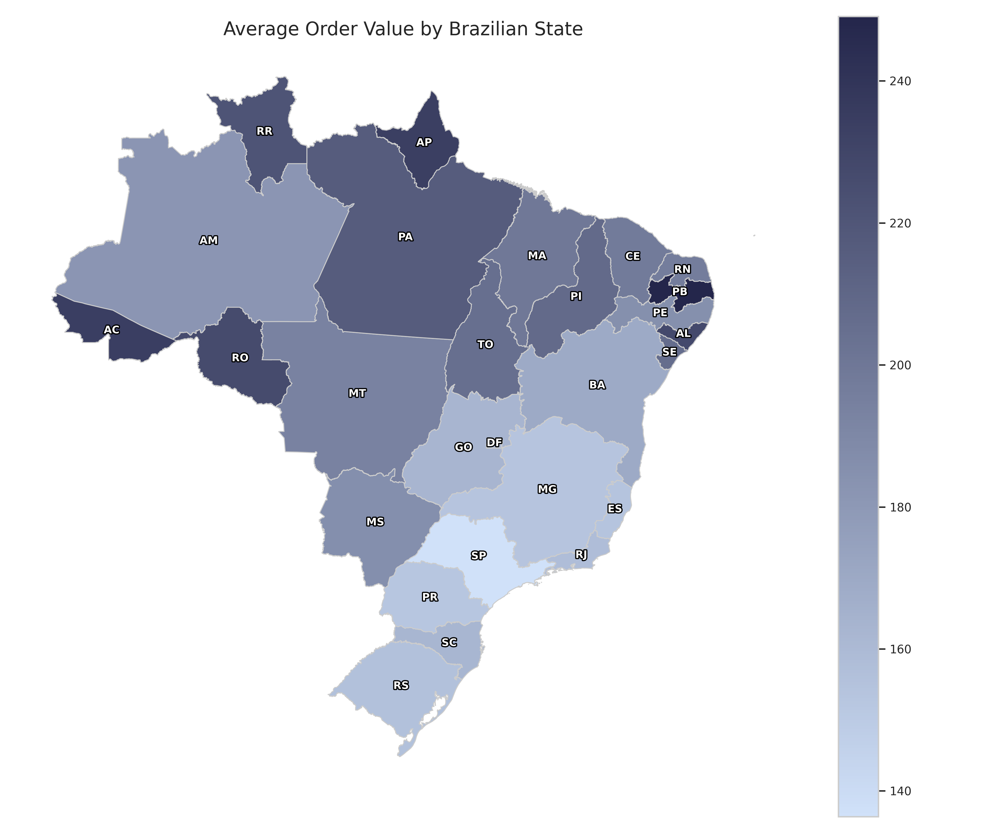
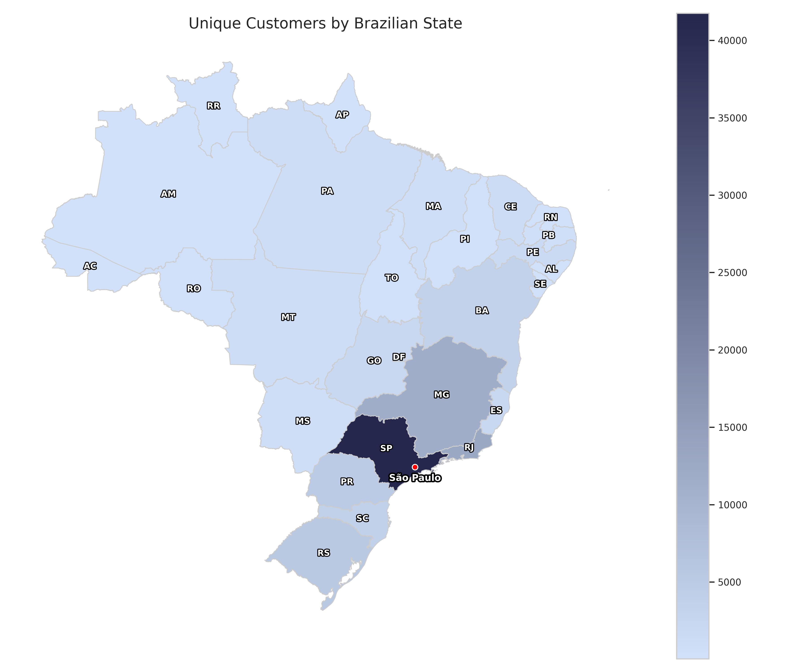
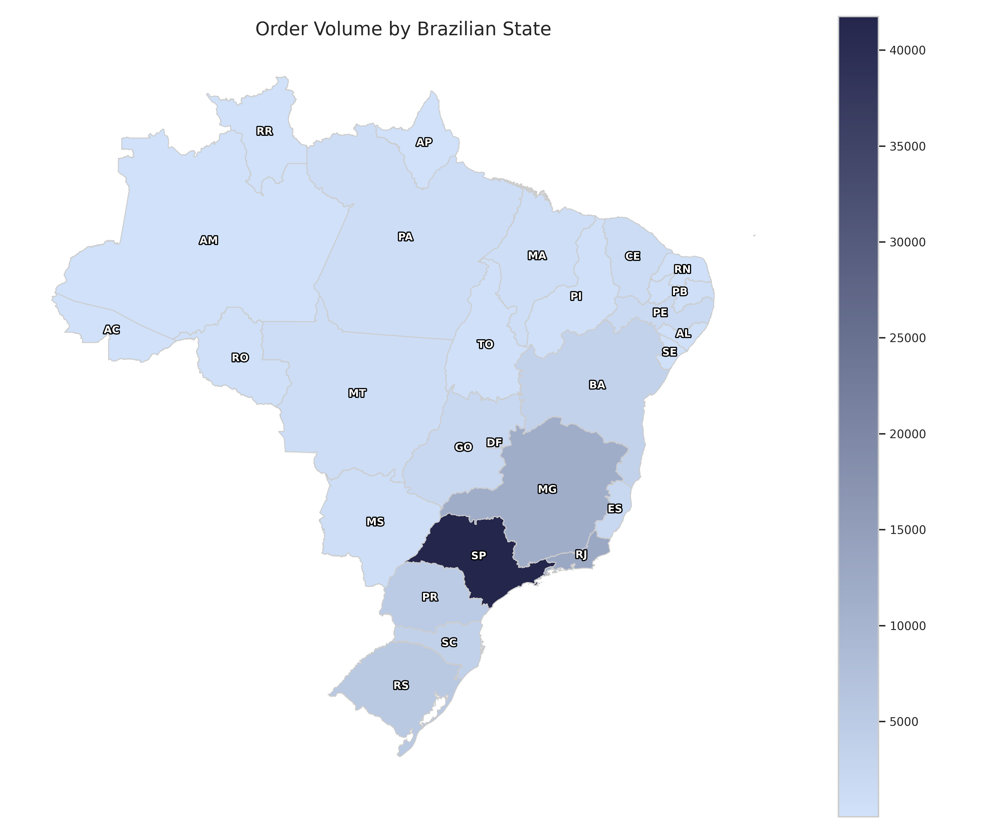
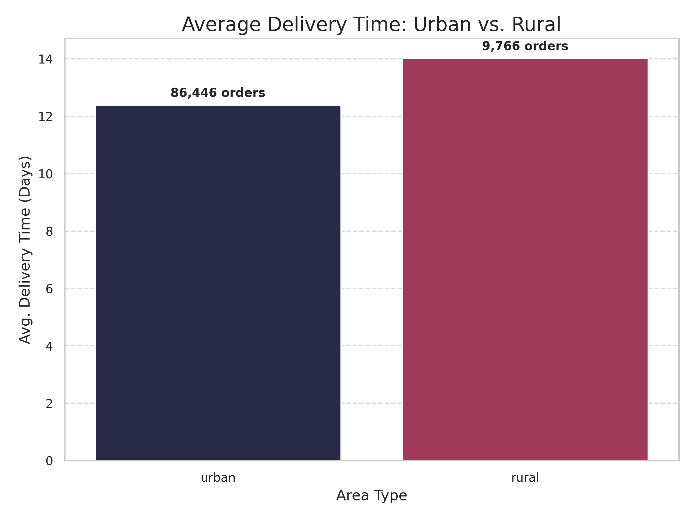

# Analysing Target E-Commerce in Brazil

This project investigates key performance and operational insights from a Brazilian e-commerce dataset using SQL queries. The goal is to address business-relevant questions by analysing orders, payments, products, customers, and more.

This report is structured into six key analytical themes, each addressing a set of business questions. The full analysis is supported by SQL scripts, visualisations, and documented insights throughout.

---

## 🧾 Data Sources

All analysis was conducted on the `target_ecommerce` schema, which contains transactional, customer, product, and location-level data. The following tables were used:

- `orders` – master table with order-level information and status
- `order_items` – product-level breakdowns per order
- `payments` – payment methods, values, and instalments
- `products` – product IDs, categories, and dimensions
- `customers` – customer profiles and location codes
- `sellers` – seller IDs and locations
- `geolocations` – latitude/longitude mapping for postal codes

For a full breakdown of relationships, see the [data dictionary](./data_dictionary.md) and the [Entity Relationship Diagram (ERD)](./erd/erd.png).

---

## 🛠️ Tools & Technologies Used

- **SQL (PostgreSQL)** – for all data querying and transformation tasks
- **Python (pandas, matplotlib, plotly)** – for data manipulation and visualisation
- **Jupyter Notebook** – used for producing visualisations
- **Markdown & Git** – for documentation and version control
- **Visual Studio Code** – primary development environment

---

## 📑 Contents

| Section | Analysis Topic                            | Key Takeaways                      |
|---------|--------------------------------------------|------------------------------------|
| 0       | [Data Sources](#🧾-data-sources)              | –                                  |
| 1       | [Sales Analysis](#section-1-sales-analysis) | [View](#section-1-key-takeaways)   |
| 2       | [Customer Behaviour](#section-2-customer-behaviour) | [View](#section-2-key-takeaways)   |
| 3       | [Logistics and Shipping Performance](#section-3-logistics-and-shipping-performance) | [View](#section-3-key-takeaways) |
| 4       | [Product Insights](#section-4-product-insights) | [View](#section-4-key-takeaways)   |
| 5       | [Payment Behaviour](#section-5-payment-behaviour) | [View](#section-5-key-takeaways)   |
| 6       | [Geospatial and Regional Insights](#section-6-geospatial-and-regional-insights) | [View](#section-6-key-takeaways) |
| 7       | [Conclusion](#section-7-conclusion) | - |

---

## 📂 Project Structure Overview

- `data/` – raw CSV datasets  
- `sql/` – analysis scripts by section  
- `sql/data_validation/` – exploratory data cleaning and integrity checks  
- `visualisations/` – final PNG charts for report visuals  
- `notebooks/` – Jupyter Notebook for producing visualisations 
- `setup/` – schema creation and data loading scripts  
- `erd/` – entity relationship diagrams  
- `README.md` – this report  

---

## **Section 1. Sales Analysis**

This section explores key revenue and performance metrics by analysing the `payments`, `orders`, and `order_items` tables.

It addresses the following business questions:
- What is the total revenue generated per year and per month?
- Which months show the highest and lowest sales performance?
- Which product categories generate the most revenue?
- What is the average order value (AOV) per state?

**Full SQL script for all Sales Analysis questions can be found [here](./sql/01_sales_analysis.sql).**

---

### Question 1: What is the total revenue generated per year and per month?

**Insight:**  

Revenue increased significantly from 2016 to 2018; however, it is important to note that the data only covers **3 months of 2016** and **the first 9 months of 2018**, making **2017 and 2018 the most complete and comparable years**.  

- In **2017**, the platform generated approximately **R$7.00 million** in revenue.  
- In **2018** (with only 9 months of data), revenue rose to **R$8.55 million**, indicating continued growth.  
- Monthly revenue trends show consistent increases throughout 2017 and strong performance in early to mid-2018.  
- Notable spikes in revenue occurred in **November 2017** and **March–May 2018**, possibly due to seasonal promotions or campaigns.

**Visualisation:**  

---

### Question 2: Which months show the highest and lowest sales performance?

**Insight:**  

The month with the highest sales performance was **November 2017**, generating approximately **R$1.16 million** in revenue, likely reflecting major seasonal promotions or holiday sales.  

The lowest sales month was **December 2016**, with just **R$19.62** in revenue, which aligns with the limited data coverage for 2016 and suggests incomplete or minimal sales activity during that period.

These extremes highlight the importance of considering data coverage when interpreting monthly performance trends.

---

### Question 3: Which product categories generate the most revenue?

**Insight:**

The top product categories by revenue highlight key drivers of sales on the platform:  
- **Health & Beauty** leads with approximately **R$1.43 million**, indicating strong consumer demand in personal care.  
- **Watches & Presents** and **Bed, Table & Bath** categories follow closely, each generating over **R$1.2 million** in revenue.  
- Other high-performing categories include **Sport & Leisure** and **Computer Accessories**, reflecting diverse customer interests.  
- Revenue gradually declines across numerous smaller categories, illustrating a long tail of niche or lower-selling products.  

This distribution suggests focusing marketing and inventory efforts on the top categories could maximise revenue, while also exploring growth potential in mid-tier categories.

**Visualisation:**

---

### Question 4: What is the average order value (AOV) per state?

**Insight:**  

The average order value varies significantly across states:  
- States like **Paraíba (PB)**, **Acre (AC)**, and **Amapá (AP)** top the list with AOVs above **R$230**, indicating higher spending per order in these regions.  
- The majority of other states fall in the **R$150–R$220** range, showing moderate average spending.  
- Notably, **São Paulo (SP)**, despite being a major economic hub, has a relatively lower AOV (~**R$136**), which could be influenced by a larger volume of smaller orders or diverse customer segments.

This variation may reflect regional differences in consumer behavior, purchasing power, or product preferences. It could inform targeted marketing strategies or tailored promotions by state.

**Visualisation:**

---

### Section 1: Key Takeaways

- **E-commerce revenue grew year-on-year**, with **R$7.00M generated in 2017** and **R$8.55M in 2018 (partial year)**. Revenue spikes in **November 2017** and **March–May 2018** suggest a response to seasonal promotions or campaigns.

- **A small set of product categories—Health & Beauty, Watches & Presents, and Bed/Table/Bath—account for the majority of revenue**, while most others follow a long-tail distribution. This highlights where marketing and inventory should be prioritised.

- **Average order value (AOV) varies greatly by region**, with **Paraíba (PB)** and **Acre (AC)** exceeding **R$230**, while **São Paulo (SP)** lags at ~**R$136**—a potential signal of diverse customer profiles, price sensitivity, or product mix across states.

---

## **Section 2. Customer Behaviour**

This section explores customer distribution, repeat purchasing behaviour, and high-value customer segments to uncover trends that can inform marketing, loyalty, and retention strategies.

It addresses the following business questions:
- Which states or cities have the highest number of unique customers?
- What is the repeat purchase rate of customers?
- How many customers place multiple orders and how often?
- Do high-value customers (top 10%) behave differently from others?

**Full SQL script for all Customer Behaviour questions can be found [here](./sql/02_customer_analysis.sql).**

---

### Question 5: Which states or cities have the highest number of unique customers?

**Insight:**

Customer distribution is concentrated in Brazil’s most populous and economically active regions:

- **São Paulo (SP)** leads with **41,746** unique customers — more than triple the count of the next state.  
- **Rio de Janeiro (RJ)** and **Minas Gerais (MG)** follow with **12,852** and **11,635** customers respectively.  
- Southern states such as **Rio Grande do Sul (RS)**, **Paraná (PR)**, and **Santa Catarina (SC)** also show notable customer presence.

At the city level, **São Paulo city** stands out with **15,540** unique customers — by far the largest urban customer base in the dataset.  

This geographic concentration highlights where to prioritise logistics, customer service, and targeted marketing to maximise reach and efficiency.

**Visualisation:**

---

### Question 6: What is the repeat purchase rate of customers?

**Insight:**

Repeat purchasing is notably low — just **3.12%** of customers placed more than one order, meaning nearly **97%** were **one-time buyers**.

This indicates:
- A strong emphasis on **customer acquisition** over retention.  
- An opportunity to boost performance through **loyalty programmes**, **email remarketing**, or **subscription models**.

Increasing the repeat purchase rate could significantly improve customer lifetime value and support long-term revenue growth.

---

### Question 7: How many customers place multiple orders and how often?

**Insight:**

Of over **96,000 customers**, only **2,997** placed more than one order, confirming a **low level of repeat engagement**.

Among those:
- **~91.6%** placed exactly **2 orders**.  
- Very few placed more:  
  - **203** placed 3 orders  
  - **30** placed 4 orders  
  - Just **1 customer** placed as many as **17 orders**

This shows a **long-tail distribution**, where high-frequency shoppers are rare.  

The sharp drop after 2–3 orders highlights the potential value in **nurturing existing customers** to become more engaged, loyal buyers.

**Visualisation:**

---

### Question 8: Do high-value customers (top 10%) behave differently from others?

**Insight:**

Yes — high-value customers demonstrate markedly different purchasing behaviour:

- On average, **top 10% customers** placed **~1.12 orders** and spent **R$641.55**.  
- In contrast, **all other customers** placed **~1.03 orders** and spent just **R$113.81**.

Although the difference in order count is relatively small, the **average spend** is over **5.6× higher** among top customers.

This suggests high-value customers tend to purchase **more expensive items** or **larger baskets**, making them ideal candidates for **premium offers**, **exclusive rewards**, or **early access promotions**.

**Visualisation:**

---

### Section 2: Key Takeaways

- **Customer concentration is regional:** Nearly half of all unique customers come from just three states — São Paulo, Rio de Janeiro, and Minas Gerais — with São Paulo city alone representing the largest single urban customer base. This regional skew has clear implications for marketing and logistics prioritisation.

- **Low customer retention:** A striking **97%** of customers are **one-time buyers**, and the majority of repeat buyers only return for a second purchase. This highlights a critical opportunity to invest in **retention strategies**, such as loyalty programs or personalised follow-ups.

- **High-value customers are big spenders, not frequent buyers:** The top 10% of customers spend over **5.6× more** than others, despite making only slightly more purchases. This indicates a strategic opportunity to nurture and retain these **high-spending segments** through tailored experiences or exclusive benefits.

---

## **Section 3. Logistics and Shipping Performance**

This section analyses delivery efficiency, regional shipping delays, and the impact of geographic distance on delivery timeliness—key considerations for improving logistics operations and customer satisfaction.

It addresses the following business questions:
- What is the average delivery time across different states?
- Which regions experience the longest delivery delays?
- Is there a relationship between shipping distance and delivery delay?

**Full SQL script for all Logistics and Shipping Performance questions can be found [here](./sql/03_logistics_and_shipping_analysis.sql).**

---

### Question 9: What is the average delivery time across different states?

**Insight:**  
Average delivery times vary significantly across Brazil, often reflecting disparities in infrastructure and geographic remoteness:

- **São Paulo (SP)** has the **fastest delivery time**, averaging **just 8.76 days**, likely due to dense infrastructure and proximity to distribution centres.  
- States such as **Paraná (PR)**, **Minas Gerais (MG)**, and **Distrito Federal (DF)** also show relatively **quick deliveries**, averaging **~12–13 days**.  
- In contrast, **northern and northeastern states** — including **Roraima (RR)**, **Amapá (AP)**, and **Amazonas (AM)** — see **significantly longer delivery times**, averaging **26–29 days**.

These findings highlight the **logistical challenges** of serving remote regions, and may support initiatives to invest in regional fulfilment centres or alternative last-mile strategies.

**Visualisation:**  
See Question 10 visualisation.

---

### Question 10: Which regions experience the longest delivery delays?

**Insight:**  
Surprisingly, deliveries across all states are **consistently early**, arriving **before the estimated delivery dates** — indicating that these estimates are set conservatively.

- Every state shows **negative average delays**, meaning products are delivered earlier than expected.  
- The extent of early delivery varies:
  - **Acre (AC)**, **Rondônia (RO)**, and **Amapá (AP)** show the **earliest deliveries**, arriving **~19–20 days ahead** of schedule.  
  - Urban centres like **São Paulo (SP)** and **Rio de Janeiro (RJ)** show more moderate early arrivals, at **~10–11 days** ahead.  
  - **Alagoas (AL)** and **Maranhão (MA)** have the **smallest margins**, at around **8 days early**.

These insights suggest that estimated delivery times include a **buffer**, particularly for remote areas. While not true "delays," understanding these margins can help refine delivery time estimates and better manage customer expectations.

**Visualisation:**  

---

### Question 11: Is there a relationship between shipping distance and delivery delay?

**Insight:**  
Yes — a relationship exists between **shipping distance and early delivery margin**, although deliveries remain largely **ahead of schedule** across all distances.

- **Most orders are delivered early**, regardless of distance.  
- The amount of early delivery **tends to increase with distance**, particularly up to **~1,000–1,200 km**.  
- Beyond **2,000 km**, patterns become less predictable — with **occasional late deliveries**, especially in extreme cases (e.g. over **8,000 km**).  
- This suggests that **conservative estimates are applied across all distances**, especially for long-haul deliveries.

These findings indicate an opportunity to **optimise delivery time promises** — particularly for mid-range distances (500–2,000 km), where the majority of orders fall.

**Visualisations:**  
  

---

### Section 3: Key Takeaways

- **Delivery speed varies widely by region:** São Paulo leads with the fastest average delivery time (~8.8 days), while remote northern and northeastern states face significantly longer times, often exceeding 25 days. This reflects geographic and infrastructure disparities impacting logistics efficiency.

- **Deliveries generally arrive earlier than expected:** Across all states, actual delivery dates tend to precede the estimated dates by 8–20 days, especially in remote regions where larger buffers appear built into estimates. Understanding this can improve customer communication and date setting.

- **Shipping distance correlates with delivery timing but not delays:** Longer shipping distances tend to result in larger early delivery margins up to ~1,000–1,200 km, beyond which delivery timing becomes more variable. This suggests room to optimise estimated delivery windows, especially for mid-range distances where most orders occur.

---

## **Section 4. Product Insights**

This section explores product-level dynamics—including return trends, freight costs, and physical product attributes—to understand fulfilment challenges and inform inventory, shipping, and warehousing strategies.

It addresses the following business questions:
- Which products or categories have the highest return rate (undelivered or cancelled)?
- Are certain product categories more associated with high freight costs?
- Which products have the highest weight or dimensional volume?

**Full SQL script for all Product Insights questions can be found [here](./sql/04_product_analysis.sql).**

---

### Question 12: Which products or categories have the highest return rate (undelivered or cancelled)?

**Insight:**  
Return rates vary considerably across both individual products and categories, highlighting potential issues related to **product quality**, **customer expectations**, or **fulfilment reliability**.

- Among **individual products** (with more than 10 orders), some exhibit elevated return rates:
  - The highest product return rate is **18.2%**.  
  - Several others exceed **9%**, although most have **low order volumes** (typically 11–13), which may inflate volatility but also point to persistent issues in niche product lines.

- By **product category** (15+ orders):
  - **Kitchen Portable and Food Coach** records the highest return rate at **6.67%**.  
  - Other categories with above-average return rates include:  
    - **Blu Ray DVDs** — 3.13%  
    - **Construction Security Tools** — 2.58%  
    - **Hygiene Diapers** — 2.56%

- In contrast, **high-volume categories** such as **Bed/Table/Bath**, **Pet Shop**, and **Home Appliances** show **very low return rates** (typically below **0.6%**), indicating strong product–market fit and reliable fulfilment processes.

These trends suggest that elevated return rates may stem from:
- **Mismatched customer expectations** (e.g. sizing, descriptions)  
- **Fulfilment issues** or delivery failures  
- Possibly **fraudulent activity** concentrated in specific categories

**Visualisation:**  

---

### Question 13: Are certain product categories more associated with high freight costs?

**Insight:**  
Freight costs vary widely by category, largely driven by the **weight**, **size**, and **handling complexity** of items.

- The **highest average freight costs** are linked to categories with bulky or heavy goods:
  - **PCs** lead with an average cost of **R$48.45** per order.  
  - Other high-cost categories include:
    - **ELECTRICES 2** — R$44.54 (likely a data inconsistency)  
    - **CITTE AND UPHACK FURNITURE** — R$42.91 (likely a mislabelled furniture segment)  
    - **Furniture Kitchen Service Area Dinner and Garden** — R$42.70  
    - Several **office and room furniture** categories also feature prominently.

- These categories generally have **moderate to low order volumes**, reinforcing that **product characteristics** (rather than volume) are the main freight cost drivers.

- Conversely, categories like **Books**, **Electronics**, **Toys**, and **Apparel** tend to have **lower freight costs** (often below **R$20**), while also accounting for higher sales volume.  
  For example, **Bed/Table/Bath** has the **highest order count (11,115)** with an average freight cost of just **R$18.42**.

These findings underscore the importance of **differentiated shipping strategies**, especially for categories requiring specialised packaging, storage, or delivery services.

**Visualisation:**  

---

### Question 14: Which products have the highest weight or dimensional volume?

**Insight:**  
The largest and heaviest products are primarily concentrated in **homeware, furniture**, and **lifestyle** categories — significantly influencing logistics, warehousing, and delivery costs.

- **Heaviest products** (by weight in grams) include:
  - A **Bed/Table/Bath** item weighing over **40 kg** (40,425g).  
  - Several **30 kg** products across categories like **Health & Beauty**, **Pet Shop**, **Furniture**, and **Sport & Leisure**.  
  - These items require **special handling**, potentially impacting packaging and courier selection.

- **Largest products** (by dimensional volume in cm³) are typically found in:
  - **Room Furniture** and **Housewares**, with items measuring up to **296,208 cm³** (~0.3 cubic metres).  
  - Multiple Room Furniture products cluster in the **288,000–294,000 cm³** range.  
  - These dimensions suggest significant implications for **storage planning** and **freight capacity**.

Tailoring logistics operations to account for product weight and volume is essential to control costs and ensure delivery efficiency for large-format or high-density goods.

**Visualisations:**

**Top 5 Heaviest Products**
| Rank | Product ID                         | Category                         | Weight (grams) |
|------:|----------------------------------|----------------------------------|----------------:|
| 1    | 26644690fde745fc4654719c3904e1db | Bed/Table/Bath                   | 40,425          |
| 2    | dcfeedf441c38e5e7e58ffce194af2bb | Health & Beauty                  | 30,000          |
| 3    | 1c57458e824ca3d974ec1831a1a55e72 | Pet Shop                         | 30,000          |
| 4    | f97ad9066c718a6cef93dfcf253d3e0d | Furniture Decoration             | 30,000          |
| 5    | 363a9f5b97bf194da23858be722a7aa5 | Construction Tools (Construction) | 30,000        |

**Top 5 Largest Products by Dimensional Volume**
| Rank | Product ID                         | Category            | Volume (cm³)  |
|------:|----------------------------------|---------------------|---------------:|
| 1    | 256a9c364b75753b97bee410c9491ad8 | Housewares          | 296,208        |
| 2    | c1e0531cb1864fd3a0cae57dca55ca80 | Room Furniture      | 294,000        |
| 3    | 0b48eade13cfad433122f23739a66898 | Furniture Decoration| 294,000        |
| 4    | f227e2d44f10f7dad30fb4dfa839e7a2 | Room Furniture      | 294,000        |
| 5    | 3eb14e65e4208c6d94b7a32e41add538 | Room Furniture      | 294,000        |

---

### Section 4: Key Takeaways

- **Product returns reveal quality, fit, and fulfillment issues:** Certain categories like **Kitchen portable**, **Blu Ray DVDs**, and **Construction Security Tools** show disproportionately high return rates (up to 6.7%), while high-volume segments like **bed/table/bath** and **pet shop** maintain very low rates (<0.6%). This signals varying levels of customer satisfaction, item suitability, and delivery success.

- **Freight costs are driven by size and fragility, not order volume:** Large and heavy categories such as **PCs**, **Furniture**, and **Room Decor** incur the highest average freight costs (over R$40/order), whereas fast-moving, lightweight items (books, apparel, electronics) enjoy significantly cheaper shipping. Optimising shipping strategies based on category traits can protect margins.

- **Bulky products dominate furniture and home segments:** The heaviest product exceeds **40 kg**, and the largest items exceed **290,000 cm³**, clustered in **Room Furniture** and **Housewares**. These dimensions emphasise the need for efficient warehousing, packaging, and logistics planning — especially for SKUs requiring special handling.

---

## **Section 5. Payment Behaviour**

This section explores how customers choose to pay—including regional preferences, segment differences, and the role of instalment plans—to inform more tailored and effective payment strategies.

It addresses the following business questions:
- What are the most commonly used payment types by state or customer segment?
- What is the average instalment plan length for orders by value or category?
- How much revenue is coming from instalment payments vs upfront?

**Full SQL script for all Payment Behaviour questions can be found [here](./sql/05_payment_analysis.sql).**

---

### Question 15: What are the most commonly used payment types by state or customer segment?

**Insight:**  
**Credit cards are the overwhelmingly preferred payment method nationwide**, accounting for over 70% of transactions in nearly every state and customer group. However, regional and behavioural nuances reveal opportunities for more tailored approaches:

- **Credit card usage** dominates across all states, typically making up **68–80%** of transactions. Usage is highest in wealthier or more urban states such as **Rio de Janeiro (76.1%)**, **Amazonas (80.5%)**, and **Pernambuco (77.2%)**.  
- **UPI-style payments (e.g., Pix)** rank second overall, with uptake ranging from **15–28%**, especially in **less urban or northern states** like **Roraima (28.3%)**, **Amapá (28.6%)**, and **Mato Grosso (24.8%)**.  
- **Vouchers** and **debit cards** remain niche methods, usually comprising less than **8%** combined, though voucher use is slightly more common in **Bahia**, **Paraná**, and **São Paulo**.

By customer type:
- **One-time customers** favour credit cards slightly more (**74.0%**) than repeat buyers (**72.7%**), and are marginally more inclined to use **UPI**.  
- **Repeat customers** show a **higher propensity for vouchers** (**8.5%**) compared to one-time buyers (**5.4%**), possibly reflecting loyalty programme usage or targeted promotions.

These patterns suggest that while **credit cards remain the norm**, UPI is gaining ground — particularly in **mobile-first or less banked regions** — and voucher schemes may play a role in **customer retention strategies**.

**Visualisations:**  
  

---

### Question 16: What is the average instalment plan length for orders by value or category?

**Insight:**  
Instalment plan length increases noticeably with order value and varies across product types:

- **High-value orders** (R$500+) average around **6.0 instalments**, compared to just **2.1 instalments** for orders under R$100.  
- **Mid-range purchases** (R$100–R$499) typically involve around **3.7 instalments**, indicating widespread use of partial payments even for moderately priced goods.

By product category:
- Longer instalment plans are seen in categories such as:
  - **PCs (6.01)**  
  - **Baking appliances (5.49)**  
  - **Room furniture (4.03)**  
  - **Home comfort products (3.99)**  
  These are generally **higher-cost, durable items**.

- Shorter plans (2 instalments or fewer) dominate in fast-moving or lower-value goods, such as:
  - **Electronics (1.80)**  
  - **Drinks (1.93)**  
  - **Books (2.16–2.35)**  
  - **Fashion accessories (2.51)**

These trends suggest that **instalment plans should be tailored by order value and product category**. Encouraging longer-term payments in high-ticket categories may drive higher-value purchases, while **discounts for upfront payment** could resonate better in lower-value segments.

**Visualisation:**  

---

### Question 17: How much revenue is coming from instalment payments vs upfront?

**Insight:**  
Instalment payments generate **significantly higher revenue** than upfront payments, despite similar transaction volumes:

- **Instalment payments** contributed approximately **R$10.1 million** from **51,340 transactions**.  
- **Upfront payments** totalled around **R$5.9 million** from **52,546 transactions**.

While the number of transactions is almost identical, the **revenue from instalments is roughly 71% higher**. This indicates that customers opting for instalments are more likely to make **higher-value purchases**.

These findings underscore the importance of offering **flexible financing options**, especially for higher-priced items. Doing so can directly impact overall revenue and average basket size.

**Visualisation:**  

---

### Section 5: Key Takeaways

- **Credit cards dominate payments across Brazil,** making up over 70% of transactions in nearly every state, while instant payments (Pix/UPI) are popular in less urbanized northern regions. Customer segments show differences too, with repeat buyers using more vouchers and one-time buyers favoring credit cards and instant payments.

- **Instalment plan lengths increase with order value and vary by category,** with high-value orders averaging around 6 instalments and categories like PCs and furniture having longer plans. Lower-value categories such as electronics and drinks mostly use shorter or single payments.

- **Instalment payments generate significantly more revenue (~$10.1M) than upfront payments (~$5.9M),** despite similar numbers of transactions, highlighting the importance of flexible financing options for higher-value purchases.

---

## **Section 6. Geospatial and Regional Insights**

This section uncovers how geography influences e-commerce performance—including where orders are concentrated and whether rural or urban areas experience longer delivery times.

It addresses the following business questions:
- What is the distribution of orders across Brazilian states?
- Do rural or urban areas tend to have longer delivery times?

**Full SQL script for all Geospatial and Regional Insights questions can be found [here](./sql/06_geospatial_and_regional_analysis.sql).**

---

### Question 18: What is the distribution of orders across Brazilian states?

**Insight:**  
Order volume is heavily concentrated in the south-eastern states, reflecting Brazil’s key population centres and economic hubs:

- **São Paulo (SP)** leads by a wide margin with **41,746 orders**, representing **42%** of the total volume.  
- **Rio de Janeiro (RJ)** and **Minas Gerais (MG)** follow with **12.9%** and **11.7%** of orders respectively.  
- Southern states such as **Rio Grande do Sul (RS)**, **Paraná (PR)**, and **Santa Catarina (SC)** also contribute significantly, collectively accounting for over **14%** of orders.

Lower order volumes appear in northern and northeastern regions, including **Amazonas (AM)**, **Acre (AC)**, and **Roraima (RR)**, each contributing **less than 0.2%**. This disparity likely reflects differences in digital infrastructure, economic activity, and e-commerce access across Brazil.

Understanding this regional distribution supports more effective logistics planning, inventory allocation, and targeted marketing aligned with local demand.

**Visualisation:**  

---

### Question 19: Do rural or urban areas tend to have longer delivery times?

**Insight:**  
Rural areas consistently face longer delivery times than urban areas, likely due to logistical challenges and geographic remoteness:

- **Rural customers wait an average of 14.0 days** for delivery — approximately **1.6 days longer** than urban customers.  
- **Urban deliveries average 12.4 days**, benefiting from greater logistics density and proximity to distribution centres.  
- Although rural orders represent only around **10%** of total deliveries, these extended delivery times could negatively impact customer satisfaction and repeat purchase behaviour in rural markets.

These findings highlight the need for **logistics optimisation** and regional service improvements, particularly to support growth in rural areas.

**Visualisation:**  

---

### Section 6: Key Takeaways

- **Orders are highly concentrated in the southeast:** São Paulo alone accounts for over **40%** of all orders, followed by Rio de Janeiro and Minas Gerais. This mirrors broader economic and population patterns, highlighting where logistics and marketing efforts will have the greatest impact.

- **Northern and remote regions remain underrepresented:** States like Amazonas, Acre, and Roraima collectively account for less than **1%** of order volume. These disparities suggest untapped potential — but also barriers such as limited digital infrastructure or delivery challenges.

- **Rural areas face longer delivery times:** Deliveries to rural customers take **1.6 days longer on average** than to urban areas, which may affect satisfaction and loyalty. This underscores the need for **targeted logistics solutions** when expanding into rural markets.

---

## 🧠 Key Skills Demonstrated

- Translating complex data into actionable insights  
- Writing clean and efficient SQL for relational analysis  
- Designing professional, insight-driven data visualisations  
- Structuring analysis reports for both technical and business audiences  
- Performing data validation and reconciling multi-source inconsistencies  

## **Section 7. Conclusion**

This analysis offers a comprehensive view of Brazil’s e-commerce landscape, uncovering actionable insights across customer behaviour, logistics, payments, and product performance.

**Key takeaways include:**
- **Customer loyalty remains a challenge**, with nearly 97% of users purchasing only once. However, the top 10% of customers contribute disproportionately to revenue—suggesting a strong case for targeted retention initiatives.
- **Geographic disparities are significant**: São Paulo dominates both sales and customer base, while northern and rural regions experience longer delivery times—highlighting opportunities for regional logistics optimisation.
- **Product returns and freight costs vary widely**, often tied to category, weight, or volume. Tailoring fulfilment strategies by product type could drive down operational inefficiencies.
- **Flexible payment options matter**: Instalment plans not only correlate with higher average purchase values, but also account for a larger share of total revenue—emphasising their strategic value in boosting order size.

Looking ahead, this project could be extended by:
- Integrating external data such as marketing spend, seasonality, or web traffic sources  
- Building automated dashboards for near real-time monitoring  
- Applying clustering or predictive modelling to identify high-risk returns or high-value customer traits  

The full analytical journey—from SQL scripting to curated visualisations—is designed not only to extract insights, but to support decision-making with clarity and intent.
