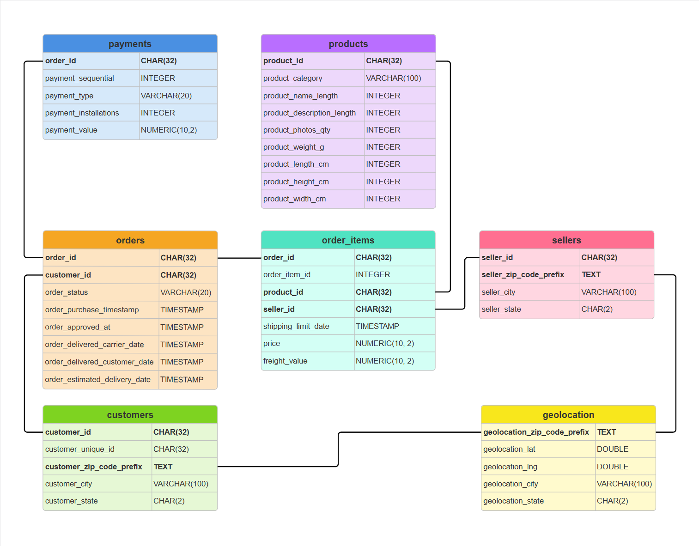

# 📚 Dataset Schema Documentation

This document outlines the structure of the dataset used in this project. Each section describes the fields within each `.csv` file—alongside a brief explanation—to support efficient querying, transformation, and analysis.

---

## 🗺️ Table of Contents

- [Entity Relationship Diagram (ERD)](#entity-relationship-diagram-erd)
- [customers.csv](#📁-customerscsv)
- [geolocations.csv](#📁-geolocationscsv)
- [order_items.csv](#📁-order_itemscsv)
- [orders.csv](#📁-orderscsv)
- [payments.csv](#📁-paymentscsv)
- [products.csv](#📁-productscsv)
- [sellers.csv](#📁-sellerscsv)

---

## 🧩 Entity Relationship Diagram (ERD)

The diagram below shows the relationships between the dataset's tables:

---

## 📁 customers.csv

| Column                     | Description                                                 |
|----------------------------|-------------------------------------------------------------|
| `customer_id`              | Unique ID for the customer making the purchase              |
| `customer_unique_id`       | Unique identifier across multiple orders from the same user |
| `customer_zip_code_prefix` | Zip code prefix (first 5 digits) of the customer’s address  |
| `customer_city`            | City where the customer is located                          |
| `customer_state`           | Two-letter Brazilian state code (e.g., SP, RJ)              |

---

## 📁 geolocations.csv

| Column                        | Description                                 |
|-------------------------------|---------------------------------------------|
| `geolocation_zip_code_prefix` | Zip code prefix used for location matching |
| `geolocation_lat`             | Latitude coordinate                         |
| `geolocation_lng`             | Longitude coordinate                        |
| `geolocation_city`            | City name                                   |
| `geolocation_state`           | Brazilian state abbreviation                |

---

## 📁 order_items.csv

| Column                | Description                                                        |
|------------------------|--------------------------------------------------------------------|
| `order_id`            | Unique ID of the associated order                                  |
| `order_item_id`       | Sequential ID for each item in the same order                      |
| `product_id`          | Identifier of the purchased product                                |
| `seller_id`           | Identifier of the seller fulfilling the order                      |
| `shipping_limit_date` | Deadline for shipping as per service level agreement               |
| `price`               | Purchase price of the product (excluding freight)                  |
| `freight_value`       | Shipping cost allocated to this item                               |

---

## 📁 orders.csv

| Column                          | Description                                              |
|----------------------------------|----------------------------------------------------------|
| `order_id`                      | Unique order identifier                                  |
| `customer_id`                   | ID of the customer who placed the order                  |
| `order_status`                  | Status of the order (e.g., delivered, canceled, shipped) |
| `order_purchase_timestamp`      | Timestamp when the order was placed                      |
| `order_approved_at`             | Timestamp when the order was approved                    |
| `order_delivered_carrier_date`  | Date the order was handed over to the carrier            |
| `order_delivered_customer_date` | Date the order was received by the customer              |
| `order_estimated_delivery_date` | Estimated delivery date                                  |

---

## 📁 payments.csv

| Column                | Description                                                         |
|------------------------|---------------------------------------------------------------------|
| `order_id`            | Unique ID of the associated order                                   |
| `payment_sequential`  | Sequence number for multiple payments (e.g., for instalments)        |
| `payment_type`        | Payment method used (e.g., credit_card, boleto, voucher)            |
| `payment_installments`| Number of instalments selected by the customer (if applicable)      |
| `payment_value`       | Total amount paid (across all instalments)                          |

---

## 📁 products.csv

| Column                     | Description                                                 |
|----------------------------|-------------------------------------------------------------|
| `product_id`               | Unique product identifier                                   |
| `product_category_name`    | Category to which the product belongs                       |
| `product_name_length`      | Length of the product name (in characters)                  |
| `product_description_length` | Length of the product description (in characters)        |
| `product_photos_qty`       | Number of product images available                          |
| `product_weight_g`         | Weight of the product in grams                              |
| `product_length_cm`        | Product length in centimeters                               |
| `product_height_cm`        | Product height in centimeters                               |
| `product_width_cm`         | Product width in centimeters                                |

---

## 📁 sellers.csv

| Column                   | Description                                         |
|--------------------------|-----------------------------------------------------|
| `seller_id`              | Unique ID assigned to each seller                  |
| `seller_zip_code_prefix` | Zip code prefix of the seller’s registered address |
| `seller_city`            | Seller’s registered city                           |
| `seller_state`           | State where the seller is located (e.g., SP, RJ)   |
